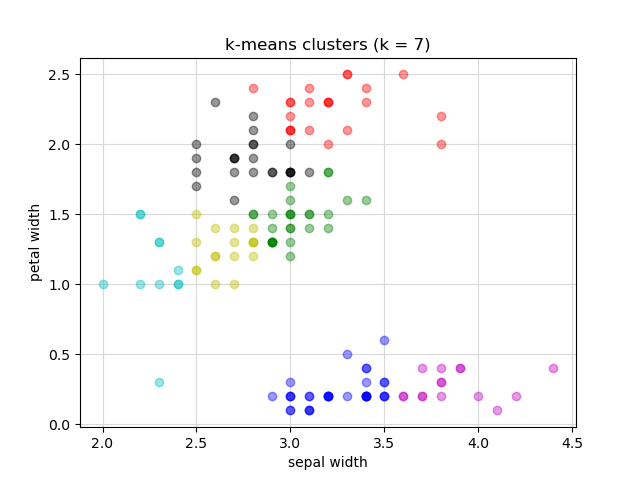

# Data Science Algorithms Implementation

This repository showcases implementations of various machine learning algorithms and data handling utilities developed for CPSC 322: Data Science Algorithms. The codebase demonstrates practical applications of decision trees, k-means clustering, and other machine learning concepts, with a focus on explicit implementation rather than relying on high-level libraries.

## Project Structure

### Core Files

1. `data_table.py`
   - Purpose: Core data structure implementation
   - Similar to pandas/numpy but with explicit implementation
   - Key components:
     - `DataRow` class for individual row representation
     - `DataTable` class for table operations
     - Data loading/saving functionality
     - Type conversion and validation
   - Example:
   ```python
   table = DataTable(['mpg', 'cylinders', 'displacement'])
   table.load('auto-mpg.txt')
   ```

2. `data_util.py`
   - Purpose: Data preprocessing utilities
   - Includes:
     - Data cleaning functions
     - Statistical computations
     - Feature selection helpers
     - Data normalization and discretization

3. `data_learn.py`
   - Purpose: Machine learning algorithm implementations
   - Contains:
     - TDIDT (Top-Down Induction of Decision Trees)
     - K-Nearest Neighbors (KNN)
     - Naive Bayes classifier
     - K-means clustering
     - Random Forest implementation

4. `data_eval.py`
   - Purpose: Model evaluation and testing
   - Features:
     - Sampling methods (bootstrap, stratified holdout)
     - Cross-validation implementations
     - Confusion matrix generation
     - Performance metrics calculation

5. `data_util.py`
   - Purpose: Data preprocessing utilities
   - Includes:
     - Data cleaning functions
     - Statistical computations
     - Feature selection helpers
     - Data normalization and discretization

5. `decision_tree.py`
   - Purpose: Base decision tree structure
   - ***Note: This file was provided by the course professor
   - Provides:
     - Tree node structure
     - Basic tree operations
     - Tree traversal utilities
     - Visualization support

## Data Processing

### 1. Data Normalization
- Logic: Scales numerical features to a standard range (typically 0-1)
- Purpose: Ensures features contribute equally to distance calculations in kNN algorithm
- Implementation:
```python
def normalize(table, column):
    """Normalizes values in a column to range [0,1]."""
    values = [row[column] for row in table]
    min_val = min(values)
    max_val = max(values)
    
    # Avoid division by zero
    if max_val == min_val:
        return
    
    # Normalize each value
    for row in table:
        row[column] = (row[column] - min_val) / (max_val - min_val)
```
- Example Usage:
```python
# Normalize displacement and weight for auto-mpg dataset
normalize(auto, 'disp')
normalize(auto, 'weight')
```

### 2. Sampling Methods

Sampling methods are crucial for evaluating machine learning models by splitting data into training and testing sets. Training data is used to build the model, while testing data evaluates its performance on unseen examples.

#### 1. Bootstrap Sampling
- Logic: Creates training set by sampling with replacement, remaining samples form testing set
- Advantage: Useful for small datasets, creates multiple training sets
- Implementation:
```python
def bootstrap(table):
    """Creates training and testing sets using bootstrap method."""
    total_rows = table.row_count()
    training_set = DataTable(table.columns())
    testing_set = DataTable(table.columns())
    
    # Sample with replacement for training set
    while training_set.row_count() < total_rows:
        rand_index = randint(0, total_rows - 1)
        training_set.append(table[rand_index].values())
    
    # Remaining rows form testing set
    for row in table:
        if row.values() not in training_set:
            testing_set.append(row.values())
    
    return (training_set, testing_set)
```

#### 2. Stratified Holdout
- Logic: Maintains class distribution in both training and testing sets
- Advantage: Preserves data distribution, crucial for imbalanced datasets
- Implementation:
```python
def stratified_holdout(table, label_col, test_size):
    """Creates stratified training and testing sets."""
    # Group rows by class label
    class_groups = {}
    for row in table:
        label = row[label_col]
        if label not in class_groups:
            class_groups[label] = []
        class_groups[label].append(row)
    
    # Create stratified split
    training_set = DataTable(table.columns())
    testing_set = DataTable(table.columns())
    
    for label, rows in class_groups.items():
        # Calculate split size for this class
        class_test_size = int(len(rows) * test_size)
        # Randomly select test samples
        test_indices = random.sample(range(len(rows)), class_test_size)
        
        # Split into train and test
        for i, row in enumerate(rows):
            if i in test_indices:
                testing_set.append(row.values())
            else:
                training_set.append(row.values())
    
    return (training_set, testing_set)
```

#### 3. Cross-Validation
- Logic: Splits data into k folds, uses each fold as testing set once
- Advantage: More robust evaluation, uses all data for both training and testing
- Implementation:
```python
def cross_validation(table, k, label_col):
    """Performs k-fold cross-validation."""
    folds = []
    fold_size = table.row_count() // k
    
    # Create k folds
    for i in range(k):
        start_idx = i * fold_size
        end_idx = start_idx + fold_size if i < k-1 else table.row_count()
        fold = DataTable(table.columns())
        for row in table[start_idx:end_idx]:
            fold.append(row.values())
        folds.append(fold)
    
    # Perform k-fold validation
    results = []
    for i in range(k):
        # Use fold i as testing set
        test_set = folds[i]
        # Combine remaining folds for training
        train_set = DataTable(table.columns())
        for j in range(k):
            if j != i:
                for row in folds[j]:
                    train_set.append(row.values())
        results.append((train_set, test_set))
    
    return results
```

## Machine Learning Algorithms

### 1. Decision Tree (TDIDT)
- Logic: Recursively builds tree by selecting best attribute for splitting
- Key Components:
  - Entropy calculation for measuring information gain
  - Attribute selection based on maximum information gain
  - Tree pruning to prevent overfitting
- Implementation:
```python
def entropy(table, label_col):
    """Calculate entropy for a given label column."""
    total = table.row_count()
    if total == 0:
        return 0
    
    # Calculate probability distribution
    counts = {}
    for row in table:
        label = row[label_col]
        counts[label] = counts.get(label, 0) + 1
    
    # Calculate entropy
    entropy = 0
    for count in counts.values():
        p = count / total
        entropy -= p * math.log2(p)
    
    return entropy
```
- Results (auto-mpg dataset):
  - Visualization: 

### 2. K-Nearest Neighbors (KNN)
- Logic: Classifies instances based on majority vote of k nearest neighbors
- Key Components:
  - Distance calculation between instances
  - K parameter selection
  - Majority voting mechanism
- Implementation:
```python
def knn_classify(train_set, test_instance, k, label_col, features):
    """Classify instance using k-nearest neighbors."""
    # Calculate distances to all training instances
    distances = []
    for train_instance in train_set:
        dist = calculate_distance(test_instance, train_instance, features)
        distances.append((dist, train_instance[label_col]))
    
    # Get k nearest neighbors
    distances.sort()
    k_nearest = distances[:k]
    
    # Majority vote
    votes = {}
    for _, label in k_nearest:
        votes[label] = votes.get(label, 0) + 1
    
    return max(votes.items(), key=lambda x: x[1])[0]
```
- Results (auto-mpg dataset):
```
Accuracy of Class Label 1: 0.890
Precision of Class Label 1: 0.905
Recall of Class Label 1: 0.884
F Measure of Class Label 1: 0.895
```

### 3. Naive Bayes
- Logic: Uses Bayes' theorem with feature independence assumption
- Key Components:
  - Prior probability calculation
  - Likelihood estimation
  - Laplace smoothing for zero probabilities
- Implementation:
```python
def naive_bayes_classify(train_set, test_instance, label_col, features):
    """Classify instance using Naive Bayes."""
    # Calculate prior probabilities
    priors = calculate_priors(train_set, label_col)
    
    # Calculate likelihoods
    likelihoods = {}
    for label in priors:
        likelihoods[label] = 1.0
        for feature in features:
            p = calculate_likelihood(train_set, test_instance, feature, label)
            likelihoods[label] *= p
    
    # Calculate posterior probabilities
    posteriors = {}
    for label in priors:
        posteriors[label] = priors[label] * likelihoods[label]
    
    return max(posteriors.items(), key=lambda x: x[1])[0]
```
- Results (auto-mpg dataset):
```
Accuracy of Class Label 1: 0.889
Precision of Class Label 1: 0.912
Recall of Class Label 1: 0.875
F Measure of Class Label 1: 0.893
```

### 4. K-Means Clustering
- Logic: Groups similar data points into k clusters by minimizing within-cluster variance
- Key Components:
  - Centroid initialization
  - Distance-based cluster assignment
  - Iterative centroid refinement
  - Total Sum of Squares (TSS) calculation
- Implementation:
```python
def k_means(table, initial_centroids, features):
    """Performs k-means clustering on the given data."""
    k = len(initial_centroids)
    centroids = initial_centroids
    old_centroids = None
    
    while centroids != old_centroids:
        # Assign points to nearest centroid
        clusters = [[] for _ in range(k)]
        for row in table:
            min_dist = float('inf')
            nearest_centroid = 0
            for i, centroid in enumerate(centroids):
                dist = calculate_distance(row, centroid, features)
                if dist < min_dist:
                    min_dist = dist
                    nearest_centroid = i
            clusters[nearest_centroid].append(row)
        
        # Update centroids
        old_centroids = centroids
        centroids = []
        for cluster in clusters:
            if cluster:
                new_centroid = calculate_centroid(cluster, features)
                centroids.append(new_centroid)
    
    return centroids
```
- Results (iris dataset):
  - Visualization: 
  - Shows clear separation of iris species based on petal and sepal measurements

## Sample Algorithm Comparison

### KNN Results (Auto MPG Dataset)
```
  Actual     1    2    3
--------  ----  ---  ---
       1  1290  168    0
       2   134  973    0
       3     0  198    0

Accuracy of Class Label 1: 0.890
Precision of Class Label 1: 0.905
Recall of Class Label 1: 0.884
F Measure of Class Label 1: 0.895

Accuracy of Class Label 2: 0.819
Precision of Class Label 2: 0.726
Recall of Class Label 2: 0.878
F Measure of Class Label 2: 0.795

Accuracy of Class Label 3: 0.928
Precision of Class Label 3: 0
Recall of Class Label 3: 0.0
F Measure of Class Label 3: 0
```

### Naive Bayes Results (Auto MPG Dataset)
```
  Actual     1    2    3
--------  ----  ---  ---
       1  1276  182    0
       2   123  850  134
       3     0  100   98

Accuracy of Class Label 1: 0.889
Precision of Class Label 1: 0.912
Recall of Class Label 1: 0.875
F Measure of Class Label 1: 0.893

Accuracy of Class Label 2: 0.804
Precision of Class Label 2: 0.786
Recall of Class Label 2: 0.707
F Measure of Class Label 2: 0.744

Accuracy of Class Label 3: 0.915
Precision of Class Label 3: 0.422
Recall of Class Label 3: 0.494
F Measure of Class Label 3: 0.455
```

Key Observations:
1. KNN performs better for class label 1 with higher precision (0.905 vs 0.912)
2. Naive Bayes shows better performance for class label 3, successfully predicting some instances
3. Both algorithms struggle with class label 2, though Naive Bayes shows slightly better recall
4. Overall, Naive Bayes provides more balanced performance across classes

## Dataset Examples

The repository includes several datasets for testing and demonstration:
- `auto-mpg.txt`: Vehicle characteristics and fuel efficiency
- `iris.txt`: Classic iris flower measurements
- `titanic.txt`: Passenger information from the Titanic
- `student-stress.txt`: Student stress level indicators

## Technical Implementation Details

### Data Processing
- Efficient matrix operations for large datasets
- Memory-optimized data structures
- Type-safe data handling
- Robust error handling and validation

### Algorithm Optimization
- Vectorized operations where possible
- Efficient data structures for nearest neighbor search
- Optimized probability calculations for Naive Bayes
- Smart pruning strategies for decision trees

## Future Improvements

Potential areas for enhancement:
1. Parallel processing for large datasets
2. Additional algorithm implementations
3. Enhanced visualization capabilities
4. Performance optimizations for large-scale data 
